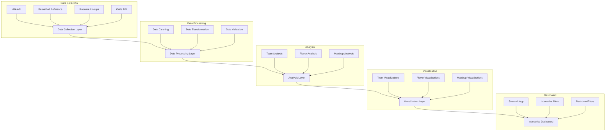

# NBA-EV System Architecture

## System Overview

The NBA-EV project is a comprehensive NBA statistics analysis platform that combines data collection, processing, analysis, and visualization through an interactive Streamlit dashboard. The system is designed to provide real-time insights into NBA team and player performance metrics.

## Architecture Diagram

## Component Details

### 1. Data Collection Layer

Multiple data sources are integrated to provide comprehensive NBA statistics:

- **NBA API Integration**: Team and player advanced statistics
- **Basketball Reference**: Historical statistics and season data
- **Rotowire Lineups**: Real-time lineup and injury information
- **Odds API**: Game odds and betting information

### 2. Data Processing Layer

Robust data processing pipeline ensuring data quality and consistency:

- **Data Cleaning**: Standardization of team names and statistics
- **Data Transformation**: Converting raw data into analysis-ready formats
- **Data Validation**: Quality checks and error handling
- **Data Storage**: Excel-based storage with daily snapshots

### 3. Analysis Layer

Comprehensive analysis modules for different aspects of NBA data:

- **Team Analysis**:
  - Offensive/defensive ratings
  - Pace factors
  - Win percentages
  - Net ratings

- **Player Analysis**:
  - Statistical distributions
  - Efficiency metrics
  - Performance correlations
  - Versatility index

- **Matchup Analysis**:
  - Team comparisons
  - Historical matchups
  - Lineup impact

### 4. Visualization Layer

Advanced visualization capabilities using multiple libraries:

- **Plotly**: Interactive visualizations for the dashboard
- **Matplotlib/Seaborn**: Static visualizations for reports
- **Custom Plots**: Specialized NBA-specific visualizations

### 5. Interactive Dashboard

Streamlit-based dashboard with real-time interaction:

- **Filters**:
  - Date selection
  - Team selection
  - Minimum minutes played
  - Statistical categories

- **Features**:
  - Team comparison plots
  - Player distribution analysis
  - Matchup analysis
  - Real-time updates

## Implementation Details

### Key Technologies

- **Python 3.11+**: Core programming language
- **Pandas/NumPy**: Data manipulation and analysis
- **Streamlit**: Interactive dashboard
- **Plotly**: Interactive visualizations
- **Selenium**: Web scraping
- **SQLite**: Data storage (planned)

### Data Flow

1. Data collection from multiple sources
2. Cleaning and standardization
3. Analysis and metric calculation
4. Storage in daily Excel snapshots
5. Loading into interactive dashboard

### Error Handling

- Comprehensive exception handling
- Fallback data sources
- Data validation checks
- Logging system

## Future Enhancements

1. **Database Integration**:
   - Migration to SQLite/PostgreSQL
   - Historical data storage
   - Query optimization

2. **Machine Learning Integration**:
   - Game outcome prediction
   - Player performance forecasting
   - Injury risk assessment

3. **API Development**:
   - RESTful API endpoints
   - Real-time data access
   - Authentication system

4. **Enhanced Visualization**:
   - Court visualization
   - Player shot charts
   - Advanced statistics

5. **Performance Optimization**:
   - Caching system
   - Parallel processing
   - Data compression

## Best Practices

The system follows these key principles:

1. **Code Quality**:
   - Type hints
   - Comprehensive documentation
   - Unit testing
   - Code formatting (black)

2. **Data Quality**:
   - Validation checks
   - Error handling
   - Data versioning
   - Backup systems

3. **Performance**:
   - Efficient data structures
   - Vectorized operations
   - Query optimization
   - Resource management

4. **Security**:
   - Environment variables
   - API key management
   - Data encryption
   - Access control

5. **Maintainability**:
   - Modular design
   - Clear documentation
   - Version control
   - Dependency management
