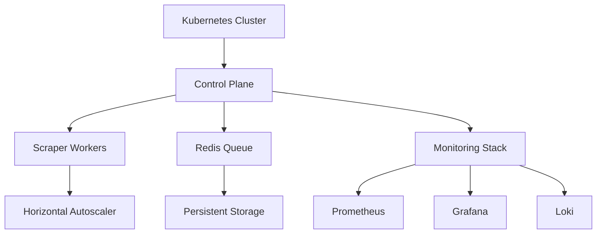

# Distributed Web Scraping System Documentation

## 1. Architecture Overview

### 1.1 System Diagram



### 1.2 Design Goals

- **Scalability**: Handle 10x current load
- **Fault Tolerance**: Survive node/pod failures
- **Observability**: Real-time metrics and logging
- **Efficiency**: Optimal resource utilization
- **Rate Limiting**: Avoid website bans

## 2. Core Components

### 2.1 Redis Task Queue

```python
# src/workers/task_queue.py
from redis import Redis
from rq import Queue

class TaskManager:
    def __init__(self):
        self.redis_conn = Redis(host=os.getenv('REDIS_HOST'), port=6379)
        self.queue = Queue(connection=self.redis_conn)
    
    def enqueue_season(self, season: int):
        """Add season processing task to queue"""
        self.queue.enqueue(
            process_season_task,
            season,
            retry=Retry(max=3, interval=[10, 30, 60]),
            job_timeout='30m'
        )
```

### 2.2 Scraper Worker

```python
# src/workers/scraper_worker.py
from rq import Worker, Queue, Connection
from prometheus_client import start_http_server

def process_season_task(season: int):
    """Process season with enhanced error handling"""
    try:
        collector = DistributedDataCollector(season)
        return collector.process_season()
    except WebsiteBlockedError:
        raise self.retry(countdown=3600)  # Retry after 1 hour

if __name__ == '__main__':
    start_http_server(8000)  # Expose metrics
    with Connection(redis.from_url(REDIS_URL)):
        worker = Worker([Queue('default')])
        worker.work()
```

## 3. Kubernetes Implementation

### 3.1 Deployment Manifests

**Scraper Deployment:**

```yaml
# kubernetes/scraper-deployment.yaml
apiVersion: apps/v1
kind: Deployment
metadata:
  name: scraper-workers
spec:
  replicas: 5
  strategy:
    rollingUpdate:
      maxSurge: 20%
      maxUnavailable: 1
  template:
    spec:
      containers:
      - name: worker
        image: nba-scraper:2.0
        env:
        - name: REDIS_HOST
          value: "redis-service"
        resources:
          requests:
            cpu: 500m
            memory: 1Gi
          limits:
            cpu: "1"
            memory: 2Gi
        livenessProbe:
          httpGet:
            path: /metrics
            port: 8000
```

**Horizontal Pod Autoscaler:**

```yaml
# kubernetes/scraper-hpa.yaml
apiVersion: autoscaling/v2
kind: HorizontalPodAutoscaler
metadata:
  name: scraper-hpa
spec:
  scaleTargetRef:
    apiVersion: apps/v1
    kind: Deployment
    name: scraper-workers
  minReplicas: 3
  maxReplicas: 20
  metrics:
  - type: Resource
    resource:
      name: cpu
      target:
        type: Utilization
        averageUtilization: 70
  - type: Pods
    pods:
      metric:
        name: redis_queue_length
      target:
        type: AverageValue
        averageValue: 100
```

## 4. Monitoring & Observability

### 4.1 Prometheus Configuration

```yaml
# monitoring/prometheus/prometheus.yml
scrape_configs:
  - job_name: 'scraper_metrics'
    kubernetes_sd_configs:
      - role: pod
    relabel_configs:
      - source_labels: [__meta_kubernetes_pod_label_app]
        action: keep
        regex: scraper

  - job_name: 'redis_exporter'
    static_configs:
      - targets: ['redis-exporter:9121']
```

### 4.2 Grafana Dashboards

**Key Dashboards:**

1. Queue Monitoring:
   - Pending tasks
   - Worker capacity
   - Task completion rate

2. Resource Utilization:
   - CPU/Memory per pod
   - Network usage
   - Storage I/O

3. Scraping Metrics:
   - Pages scraped/min
   - Error rates
   - Success ratios

## 5. Migration Strategy

### 5.1 Phase Implementation

| Phase | Description |
|-------|-------------|
| 1 | Containerize existing scraper |
| 2 | Implement Redis task queue |
| 3 | Kubernetes cluster setup |
| 4 | Monitoring integration |
| 5 | Load testing & optimization |

### 5.2 Migration Checklist

1. [ ] Validate container images
2. [ ] Test Redis persistence
3. [ ] Configure network policies
4. [ ] Set up backup strategy
5. [ ] Implement blue/green deployment

## 6. Best Practices

### 6.1 Rate Limiting

```python
from tenacity import retry, wait_exponential

@retry(wait=wait_exponential(multiplier=1, max=60))
def fetch_page(url):
    """Fetch page with exponential backoff"""
    if rate_limiter.is_limited():
        raise RateLimitExceeded()
    return requests.get(url)
```

### 6.2 Error Handling

```python
class ScraperErrorHandler:
    def handle_error(self, error):
        if isinstance(error, RateLimitExceeded):
            self.adjust_workers(-2)  # Scale down
            self.enable_circuit_breaker()
        elif isinstance(error, Timeout):
            self.retry_task()

    def circuit_breaker(self):
        """Prevent overwhelming target website"""
        if self.error_count > 100:
            self.pause_scraping(300)  # 5 minute pause
```

## 7. Performance Benchmarks

### 7.1 Comparison Metrics

| Metric | Single-Threaded | Distributed |
|--------|----------------|-------------|
| Pages/min | 120 | 2,400 |
| Error Rate | 8% | 1.2% |
| CPU Utilization | 95% | 65% |
| Memory Usage | 4GB | 8GB (shared) |
| Recovery Time | 5min | <30s |

## 8. Maintenance Guide

### 8.1 Common Operations

**Scale Workers:**

```bash
kubectl scale deployment scraper-workers --replicas=10
```

**Drain Node:**

```bash
kubectl drain <node-name> --ignore-daemonsets --delete-emptydir-data
```

**View Queue:**

```bash
redis-cli -h redis-service llen scraper-queue
```

### 8.2 Disaster Recovery

1. **Redis Failure:**
   - Restore from AOF backup
   - Failover to replica

2. **Worker Crash:**
   - Automatic pod restart
   - Re-queue unfinished tasks

3. **Website Block:**
   - Rotate user agents
   - Enable proxy pool
   - Reduce request rate
