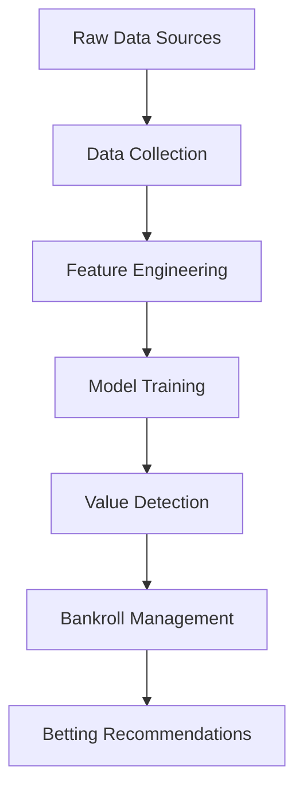

# NBA +EV Betting Model Architecture

## Model Overview

The betting model combines machine learning with sports analytics to identify mispriced betting markets. It leverages data from multiple sources through our collection pipeline:



## Core Components

### 1. Feature Engineering Pipeline

Integrated with data from `schedule.parquet` and `player_stats.parquet`:

```python
def create_betting_features(game_data: pd.DataFrame) -> pd.DataFrame:
    """Create features for betting model from raw game data"""
    return (
        game_data
        .pipe(calculate_rest_advantages)
        .pipe(add_team_metrics)
        .pipe(add_player_availability)
        .pipe(add_market_context)
        .pipe(validate_features)
    )
```

**Key Features:**

- Team efficiency metrics (Last 10 games)
- Player rotation health scores
- Travel miles differential
- Market consensus indicators
- Historical matchup performance

### 2. Machine Learning Architecture

Integrated with `NBAAnalyzer` class:

```python
class EVBettingModel:
    def __init__(self, data_collector: NBADataCollector):
        self.collector = data_collector
        self.pipeline = Pipeline([
            ('preprocessor', FeatureUnion([
                ('num', StandardScaler()),
                ('cat', OneHotEncoder())
            ])),
            ('model', Ensemble([
                ('gb', GradientBoostingClassifier()),
                ('nn', MLPClassifier(hidden_layer_sizes=(50,)))
            ]))
        ])
    
    async def update_model(self):
        """Update model with latest data"""
        await self.collector.update_data()
        features = self.create_features()
        self.pipeline.fit(features, self.collector.game_outcomes)
```

### 3. Value Detection System

Leverages odds data from `odds_api.py`:

```python
def calculate_edge(predicted_prob: float, odds: float) -> float:
    """Calculate +EV edge percentage"""
    implied_prob = 1 / odds
    return (predicted_prob - implied_prob) / implied_prob

def find_value_bets(model, games: pd.DataFrame) -> pd.DataFrame:
    """Identify +EV bets using model predictions"""
    features = prepare_features(games)
    preds = model.predict_proba(features)[:, 1]
    
    return (
        pd.DataFrame({
            'game_id': games['game_id'],
            'predicted_prob': preds,
            'implied_prob': 1 / games['odds'],
            'edge': preds - (1 / games['odds']),
            'kelly': kelly_criterion(preds, games['odds'])
        })
        .query('edge > 0.02 & kelly > 0.01')
        .sort_values('edge', ascending=False)
    )
```

## Data Integration

### Feature Sources

| Feature Category       | Data Source                  | Example Features                  |
|------------------------|------------------------------|-----------------------------------|
| Team Performance       | `team_stats.parquet`         | ORTG, DRTG, Pace, Net Rating      |
| Player Availability    | `lineups_scraper.py`         | Starter Health, Bench Depth       |
| Situational Factors    | `schedule.parquet`           | Rest Days, Travel Miles           |
| Market Context         | `odds_api.py`                | Line Movement, Public Percentage  |
| Historical Matchups    | `historical_data.py`         | H2H Trends, Referee Tendencies     |

## Model Validation

Integrated with testing from `test_collection.py`:

```python
def backtest_model(historical_data: pd.DataFrame) -> dict:
    """Walk-forward backtesting of betting strategy"""
    results = []
    for season in historical_data['season'].unique():
        train = historical_data[historical_data['season'] < season]
        test = historical_data[historical_data['season'] == season]
        
        model = train_model(train)
        preds = model.predict_proba(test)
        
        results.append(calculate_profitability(preds, test['odds']))
    
    return pd.concat(results)
```

**Validation Metrics:**

- Return on Investment (ROI)
- Sharpe Ratio
- Maximum Drawdown
- Win Rate
- Confidence Correlation

## Risk Management

Integrated with bankroll management:

```python
def calculate_stakes(edge: float, odds: float, bankroll: float) -> float:
    """Calculate optimal stake using Kelly Criterion"""
    b = odds - 1
    fraction = (b * edge - (1 - edge)) / b
    return max(min(fraction * bankroll, bankroll * 0.05), 0)
```

## Monitoring System

```python
class ModelMonitor:
    def __init__(self, model: EVBettingModel):
        self.model = model
        self.performance = pd.DataFrame()
    
    async def track_performance(self):
        """Monitor model performance in production"""
        while True:
            current_perf = await self.calculate_live_performance()
            self.performance = pd.concat([self.performance, current_perf])
            await asyncio.sleep(3600)  # Hourly updates
    
    def generate_report(self):
        """Create monitoring dashboard"""
        return (
            self.performance
            .pipe(create_performance_plots)
            .pipe(calculate_risk_metrics)
            .pipe(generate_alert_flags)
        )
```

## Implementation Workflow

1. **Data Collection** (via `NBADataCollector`)
2. **Feature Engineering** (using `data_processing.py`)
3. **Model Training** (daily retraining)
4. **Value Detection** (real-time odds analysis)
5. **Bankroll Management** (position sizing)
6. **Execution Monitoring** (performance tracking)

## Integration Points

### Existing Components

| Betting Model Component | Project Integration Point         |
|-------------------------|------------------------------------|
| Feature Calculation     | `src/analysis/efficiency.py`      |
| Odds Data               | `src/collectors/odds_api.py`       |
| Player Availability     | `src/collectors/lineups_scraper.py`|
| Backtesting             | `tests/test_collection.py`         |
| Monitoring              | `src/utils/monitoring.py`          |

This architecture leverages our existing data pipeline while adding sophisticated betting market analysis capabilities. The model integrates seamlessly with the core NBA-EV infrastructure while maintaining separation of concerns through modular design.
