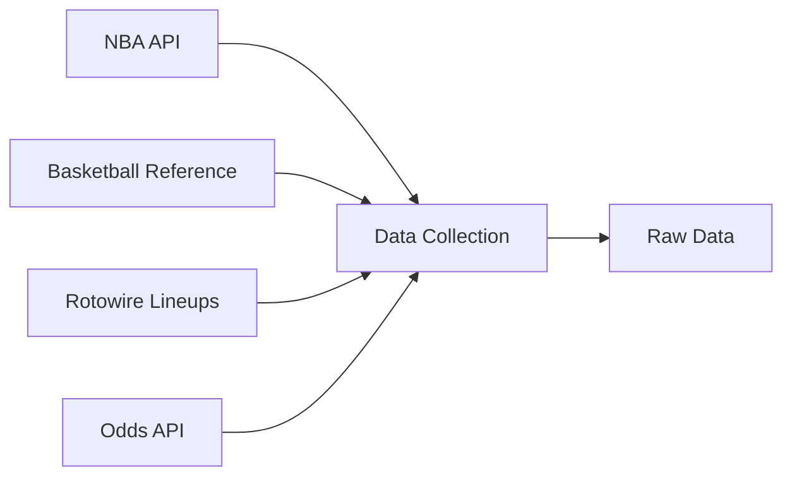
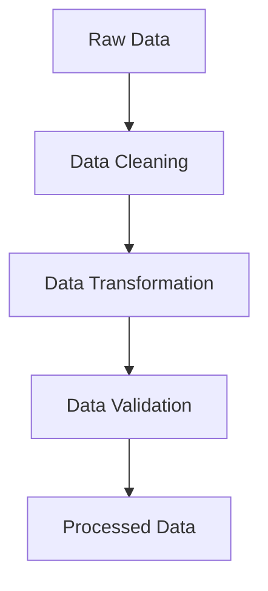
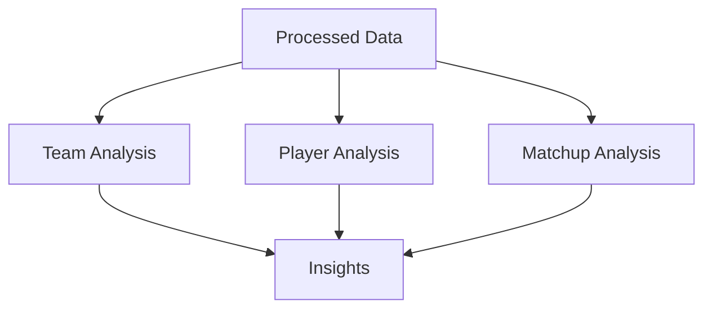
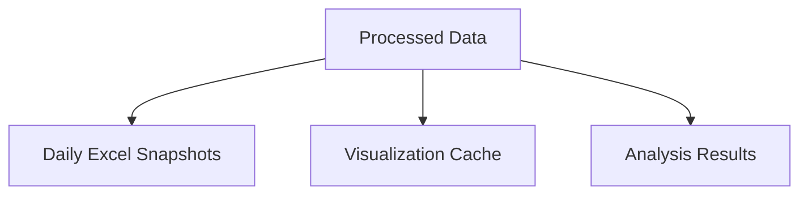

# NBA-EV Data Pipeline

## Overview

The NBA-EV data pipeline is a comprehensive system for collecting, processing, and analyzing NBA statistics. The pipeline runs daily to gather the latest data and generate insights through the following stages:

## Pipeline Stages

### 1. Data Collection

Multiple data sources are integrated through specialized collectors:



#### Collectors

1. **NBA API Collector** (`src/collectors/nba_api.py`):
   - Team advanced statistics
   - Player advanced statistics
   - League standings

2. **Basketball Reference Collector** (`src/collectors/basketball_reference.py`):
   - Season statistics
   - Player career data
   - Historical game logs

3. **Lineups Collector** (`src/collectors/lineups_scraper.py`):
   - Current matchups
   - Team lineups
   - Injury reports
   - Depth charts

4. **Odds API Collector** (`src/collectors/odds_api.py`):
   - Game odds
   - Betting lines
   - Market movements

### 2. Data Processing

Raw data undergoes several processing steps:



#### Processing Steps

1. **Data Cleaning** (`src/analysis/data_cleaning.py`):
   - Standardize team names
   - Handle missing values
   - Remove duplicates
   - Format data types

2. **Data Transformation**:
   - Calculate advanced metrics
   - Normalize statistics
   - Create derived features
   - Merge related datasets

3. **Data Validation**:
   - Check data completeness
   - Validate statistical ranges
   - Ensure data consistency
   - Log validation results

### 3. Analysis

Processed data is analyzed to generate insights:



#### Analysis Modules

1. **Team Analysis** (`src/analysis/efficiency.py`):
   - Offensive/defensive ratings
   - Pace factors
   - Win percentages
   - Net ratings

2. **Player Analysis**:
   - Statistical distributions
   - Efficiency metrics
   - Performance correlations
   - Versatility index

3. **Matchup Analysis**:
   - Team comparisons
   - Historical matchups
   - Lineup impact

### 4. Data Storage

Data is stored in multiple formats:



#### Storage Formats

1. **Excel Snapshots** (`data/`):
   - Daily data snapshots
   - Multiple sheets per file
   - Standardized format
   - Version tracking

2. **Visualization Data**:
   - Pre-computed statistics
   - Cached visualizations
   - Interactive plot data

3. **Analysis Results**:
   - Derived metrics
   - Statistical models
   - Performance indicators

## Pipeline Execution

### Daily Update Process

1. **Initialization**:

   ```python
   # Load environment variables
   load_dotenv()
   
   # Initialize collectors
   odds_collector = OddsAPICollector(api_key)
   lineups_collector = LineupsCollector()
   ```

2. **Data Collection**:

   ```python
   # Collect data from all sources
   bref_stats = get_season_stats(year)
   nba_stats = get_team_advanced_stats()
   lineups = lineups_collector.get_lineups()
   odds = odds_collector.get_nba_odds()
   ```

3. **Data Processing**:

   ```python
   # Clean and prepare data
   cleaned_data = prepare_data_for_visualization(
       team_stats=team_stats,
       player_stats=player_stats,
       odds_data=odds_df
   )
   ```

4. **Analysis**:

   ```python
   # Calculate efficiency metrics
   team_efficiency = calculate_team_efficiency(team_stats)
   player_efficiency = calculate_player_efficiency(player_stats)
   pace_factors = calculate_pace_factors(team_stats)
   ```

5. **Storage**:

   ```python
   # Save to Excel
   with pd.ExcelWriter(excel_path) as writer:
       for sheet_name, df in data_to_save.items():
           df.to_excel(writer, sheet_name=sheet_name)
   ```

### Error Handling

The pipeline includes comprehensive error handling:

1. **Collection Errors**:
   - Retry mechanisms
   - Fallback data sources
   - Error logging

2. **Processing Errors**:
   - Data validation checks
   - Exception handling
   - Warning systems

3. **Storage Errors**:
   - Backup procedures
   - Transaction rollback
   - Integrity checks

## Monitoring and Maintenance

### Pipeline Monitoring

1. **Logging**:
   - Error tracking
   - Performance metrics
   - Data quality checks

2. **Alerts**:
   - Failed collections
   - Data anomalies
   - System errors

### Maintenance Tasks

1. **Daily**:
   - Data collection
   - Quality checks
   - Error resolution

2. **Weekly**:
   - Performance review
   - Storage cleanup
   - Log rotation

3. **Monthly**:
   - System updates
   - Documentation review
   - Performance optimization
