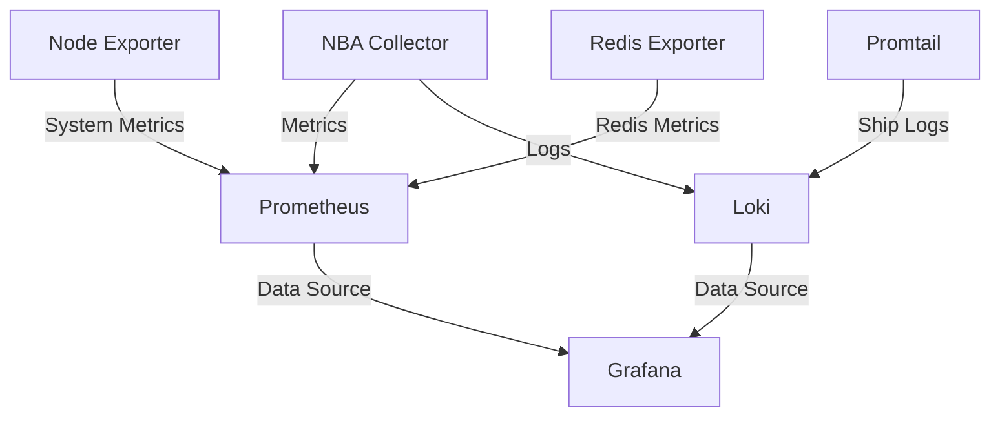

# Monitoring Setup Guide

This guide covers the setup and configuration of the monitoring stack (Prometheus, Grafana, Loki) for the NBA Data Analytics Platform.

## Overview

The monitoring stack consists of:

- **Prometheus**: Metrics collection and storage
- **Grafana**: Visualization and dashboards
- **Loki**: Log aggregation
- **Node Exporter**: System metrics
- **Redis Exporter**: Redis metrics
- **Promtail**: Log shipping

## Architecture



## Metrics Available

### Application Metrics

- `nba_games_collected_total`: Total number of games collected
- `nba_box_scores_collected_total`: Total number of box scores collected
- `nba_collection_errors_total`: Collection errors by type
- `nba_cpu_usage_percent`: CPU usage
- `nba_memory_usage_bytes`: Memory usage
- `nba_batch_processing_seconds`: Processing time histogram

### System Metrics

- CPU usage
- Memory usage
- Disk I/O
- Network traffic

### Redis Metrics

- Connected clients
- Memory usage
- Command statistics
- Cache hits/misses

## Setup Instructions

### 1. Prometheus Setup

1. **Configuration**

   ```bash
   # Verify prometheus.yml
   cat monitoring/prometheus/prometheus.yml
   ```

2. **Scrape Targets**

   ```yaml
   scrape_configs:
     - job_name: "nba-collector"
       static_configs:
         - targets: ["app:8000"]
       metrics_path: /metrics
       scrape_interval: 5s
   ```

3. **Verify Prometheus**

   ```bash
   # Check Prometheus targets
   curl http://localhost:9090/api/v1/targets
   ```

### 2. Grafana Setup

1. **Access Grafana**
   - URL: <http://localhost:3000>
   - Default credentials: admin/admin

2. **Configure Data Sources**

   ```bash
   # Verify datasources configuration
   cat monitoring/grafana/datasources/datasources.yaml
   ```

3. **Import Dashboards**
   - NBA Collector Dashboard
   - System Overview
   - Redis Metrics
   - Log Analysis

### 3. Loki Setup

1. **Configuration**

   ```bash
   # Verify Loki config
   cat monitoring/loki/loki-config.yaml
   ```

2. **Configure Promtail**

   ```bash
   # Verify Promtail config
   cat monitoring/promtail/promtail-config.yml
   ```

## Dashboard Configuration

### NBA Collector Dashboard

1. **Collection Progress**
   - Games collected
   - Box scores collected
   - Collection rate

2. **Resource Usage**
   - CPU usage gauge
   - Memory usage graph
   - Collection errors

3. **Performance Metrics**
   - Batch processing time
   - Request duration
   - Cache performance

### System Overview Dashboard

1. **System Resources**
   - CPU utilization
   - Memory usage
   - Disk I/O
   - Network traffic

2. **Container Metrics**
   - Container CPU
   - Container memory
   - Container restarts

### Log Analysis Dashboard

1. **Log Levels**
   - Error rate
   - Warning rate
   - Info messages

2. **Error Analysis**
   - Error types
   - Error frequency
   - Error patterns

## Alerting Setup

### 1. Configure Alert Rules

```yaml
groups:
  - name: nba_collector
    rules:
      - alert: HighErrorRate
        expr: rate(nba_collection_errors_total[5m]) > 0.1
        for: 5m
        labels:
          severity: warning
        annotations:
          summary: High collection error rate
```

### 2. Configure Alert Channels

1. **Email Alerts**

   ```yaml
   receivers:
     - name: email-notifications
       email_configs:
         - to: your.email@example.com
   ```

2. **Slack Alerts**

   ```yaml
   receivers:
     - name: slack-notifications
       slack_configs:
         - channel: '#monitoring'
   ```

## Maintenance

### 1. Log Rotation

```bash
# Configure log rotation
cat > /etc/logrotate.d/nba-collector << EOF
/var/log/nba-collector/*.log {
    daily
    rotate 7
    compress
    delaycompress
    notifempty
    create 0640 nba-collector nba-collector
}
EOF
```

### 2. Metric Retention

```yaml
# Prometheus retention settings
prometheus:
  retention:
    time: 15d
    size: 10GB
```

### 3. Dashboard Backup

```bash
# Export dashboards
curl -X GET http://localhost:3000/api/dashboards/uid/nba_collector > backup/dashboards/nba_collector.json
```

## Troubleshooting

### Common Issues

1. **Metrics Not Showing**

   ```bash
   # Check metrics endpoint
   curl http://localhost:8000/metrics
   
   # Check Prometheus targets
   curl http://localhost:9090/api/v1/targets
   ```

2. **Missing Logs**

   ```bash
   # Check Promtail status
   curl http://localhost:9080/ready
   
   # Check Loki status
   curl http://localhost:3100/ready
   ```

3. **Dashboard Issues**

   ```bash
   # Verify Grafana datasources
   curl http://localhost:3000/api/datasources
   ```

## Next Steps

1. Review [Data Collection Guide](../guides/data_collection.md)
2. Set up [Custom Dashboards](../guides/visualization.md)
3. Configure [Alerts](../guides/alerting.md)

## References

- [Prometheus Documentation](https://prometheus.io/docs/)
- [Grafana Documentation](https://grafana.com/docs/)
- [Loki Documentation](https://grafana.com/docs/loki/latest/)
