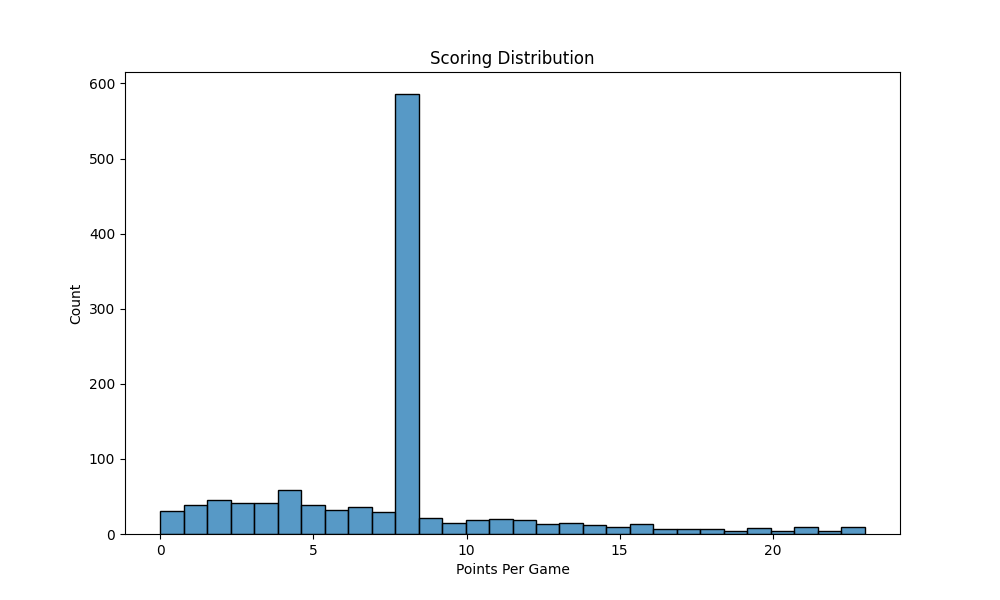
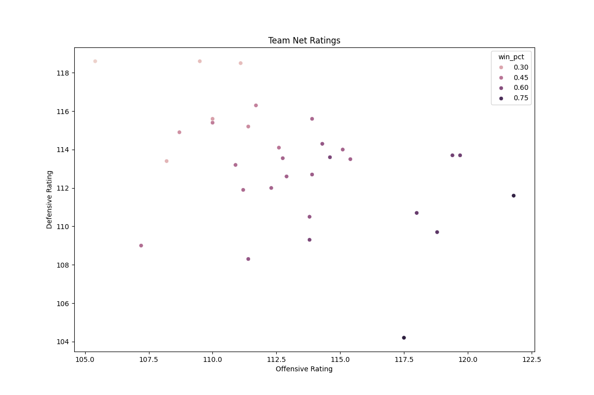
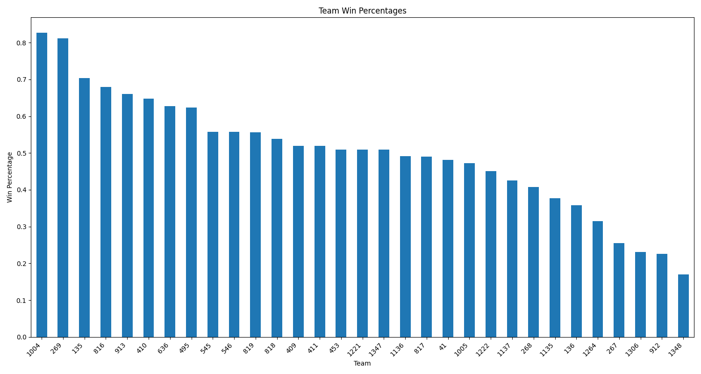

# NBA Statistics Visualization Guide

This guide explains each visualization produced by the NBA-EV project, including what they mean and how to interpret them.

## 1. Offensive vs Defensive Ratings Plot

### Description

A scatter plot showing team performance on both offense and defense, with each team represented as a point.

### Axes

- **X-axis**: Offensive Rating (points scored per 100 possessions)
- **Y-axis**: Defensive Rating (points allowed per 100 possessions)

### Interpretation

The plot creates four quadrants that tell different stories:

- **Top-Right**: Good offense, poor defense
  - Teams that can score but struggle to get stops
  - Often exciting but inconsistent teams
- **Bottom-Right**: Elite teams
  - Strong on both offense and defense
  - Typical championship contenders
- **Top-Left**: Struggling teams
  - Poor performance on both ends
  - Often rebuilding or developing teams
- **Bottom-Left**: Good defense, poor offense
  - Teams that can defend but struggle to score
  - Often competitive but limited teams

### Key Insights

- Teams closer to the bottom-right are generally more successful
- The further right on the x-axis, the better the offense
- The further down on the y-axis, the better the defense
- Median lines help identify above/below average performance

## 2. Team Pace Factors

### Description

A bar plot showing how fast each team plays, measured by possessions per 48 minutes.

### Axes

- **X-axis**: Team names
- **Y-axis**: Pace (possessions per 48 minutes)

### Interpretation

- **Higher bars**: Fast-paced teams
  - Prefer up-tempo basketball
  - More possessions per game
  - Often younger, more athletic teams
- **Lower bars**: Slower-paced teams
  - More methodical approach
  - Fewer possessions per game
  - Often veteran teams or defensive-focused

### Key Insights

- Pace doesn't necessarily correlate with success
- Helps understand team strategy and style
- Important for matchup analysis and game planning
- Can indicate how teams might match up in head-to-head games

## 3. Scoring Distribution

### Description

A box plot showing the distribution of points scored in games, combining both home and away scores.

### Components

- **Box**: Represents the middle 50% of scores
  - Top of box: 75th percentile
  - Middle line: Median score
  - Bottom of box: 25th percentile
- **Whiskers**: Extend to most extreme non-outlier scores
- **Points**: Individual outlier games

### Interpretation

- **Box Size**: Indicates scoring consistency
  - Smaller box = More consistent scoring
  - Larger box = More variable scoring
- **Outliers**: Show unusually high or low scoring games
- **Median Line**: Shows typical scoring performance

### Key Insights

- Helps identify team scoring consistency
- Shows scoring range and variability
- Identifies unusual scoring performances
- Useful for understanding team reliability

## 4. Team Net Ratings

### Description

A horizontal bar chart showing team net ratings (point differential per 100 possessions).

### Components

- **Green Bars**: Positive net ratings (outscoring opponents)
- **Red Bars**: Negative net ratings (being outscored)
- **Bar Length**: Magnitude of rating

### Interpretation

- **Positive Ratings**: Teams outperforming opponents
  - Longer green bars = More dominant teams
  - Short green bars = Slightly better than opponents
- **Negative Ratings**: Teams underperforming
  - Longer red bars = Struggling teams
  - Short red bars = Slightly worse than opponents

### Key Insights

- Often better predictor of future success than win-loss record
- Shows team dominance or struggles in standardized way
- Accounts for pace differences between teams
- Useful for identifying underrated or overrated teams

## 5. Win Percentages

### Description

A horizontal bar chart showing team win percentages with exact values labeled.

### Components

- **Bars**: Visual representation of win percentage
- **Labels**: Exact win percentage values
- **Teams**: Sorted from highest to lowest

### Interpretation

- **Higher Percentages**: More successful teams
  - >.600 typically indicates strong playoff teams
  - >.700 indicates elite teams
- **Lower Percentages**: Less successful teams
  - <.400 typically indicates struggling teams
  - <.300 indicates rebuilding teams

### Key Insights

- Most direct measure of team success
- Important for playoff positioning
- Shows clear hierarchy of team performance
- Useful for quick team comparisons

## Using These Visualizations Together

### For Team Analysis

1. Start with win percentage for overall success
2. Check net rating for performance quality
3. Look at offensive/defensive plot for strengths/weaknesses
4. Use pace to understand playing style
5. Check scoring distribution for consistency

### For Matchup Analysis

1. Compare net ratings for overall strength
2. Look at pace factors for style clash
3. Check offensive vs defensive matchups
4. Consider scoring distributions for volatility
5. Use win percentages for context

### For Trend Analysis

1. Track changes in net ratings over time
2. Monitor pace changes with lineup changes
3. Watch for scoring distribution changes
4. Note movements in offensive/defensive plot
5. Compare win percentage trends

## Best Practices for Interpretation

1. **Consider Context**
   - Time of season
   - Strength of schedule
   - Injuries and roster changes
   - Recent team trends

2. **Look for Patterns**
   - Consistent strengths/weaknesses
   - Style matchups
   - Performance trends
   - Statistical anomalies

3. **Combine Insights**
   - Use multiple visualizations
   - Look for correlations
   - Consider contradictions
   - Form comprehensive views

4. **Update Regularly**
   - Track changes over time
   - Note significant shifts
   - Monitor trends
   - Adjust interpretations
